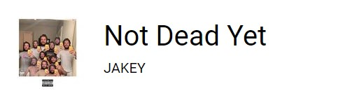

<h1 align="center">OBS Deeezer live preview</h1>
<p align="center">OBS Studio live preview of your Deezer music</p>

<p align="center"></p>

## Installation

1. Download the this repository source code
2. Open `env.js` in a text editor and set your userId & token.
3. In OBS, add the `index.html` file as a source : `Add Source > Browser > New source > Local Files > index.html`

### How to find your Deezer userId & token

- The Deezer documentation explains [how to find your userID](https://support.deezer.com/hc/en-gb/articles/360016118958-Managing-your-Deezer-information).
- The token is harder to get since the `Get Token` button in the Deezer documentation isn't working 🤷‍♂️. I made a simple video below showing the steps to retrieve the token with Browsers DevTools.

https://user-images.githubusercontent.com/45725915/149678720-69e8b907-5305-4798-8c41-8bbbca654359.mp4

## Customize the player

You can freely edit the `index.html` & `style.css` files to match your desired design.

- If you want to show more information in the HTML, you just need to provide an additionnal `data-api` attribute on your element with its corresponding path in the API response.
- If you need to set a special html attribute like `src` for images, you can do so by specifying the attribute with `data-attr`.

### Showing the album title as text inside the HTML element

```html
<div data-api="album.title"></div>
```

### Showing the album image inside an element

```html

```

### Disclaimer

The player is made by reverse engineering the Deezer WebSocket API. Any change on their side might broke the player. Feel free to contribute / open an issue.

> Most of the reverse engineering work has been made by [nSimon](https://github.com/nSimonFR/deezer-playing-notifications)
